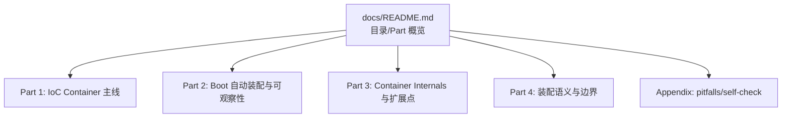

# Technical Design: spring-core-beans 文档书本化（Bookify）

## Technical Solution

### Core Technologies
- Markdown（GitHub Flavored Markdown）
- Maven + JUnit（用于保留既有 Labs/Exercises 的“可复现入口”约束）

### Implementation Key Points

1. **建立 docs 的“书本入口”**
   - 新增 `docs/beans/spring-core-beans/README.md`（目录页/Part 概览/主线阅读路径）
   - 目录页的组织风格参考 Spring 官方 Reference Docs：先给“全书总览”，再给“分 Part 的章节树”

2. **信息架构（IA）重构：Part 目录 + 章节迁移**
   - 在 `docs/` 下按 Part 创建子目录（例如 `part-01-.../`、`part-02-.../` 等）
   - 允许对章节移动/重命名/重新编号，但优先保留现有“知识点颗粒度”，避免为了形式合并/拆分导致丢信息

3. **章节模板（A–G）标准化**
   - 每章顶部加入统一导航（验收项 a）：上一章｜目录｜下一章
   - 每章开头统一包含（A/B）：本章定位 + 核心结论
   - 正文按（C/D/E/F）组织：机制主线 → 源码解析 → 最小实验 → 常见坑
   - 结尾统一输出（G，验收项 b）：本章小结 + 下一章预告

4. **链接修复与一致性审计**
   - 全局修复 `docs/**` 内部链接（章节相互引用、深挖指南引用、README 引用）
   - 更新 `spring-core-beans/README.md` 的 docs 索引链接（指向新目录）
   - 做一次“全书一致性审计”：目录可达、上一章/下一章可达、每章 A–G 段落完整

## Architecture Design

本次变更的“结构设计”主要体现在 docs 信息架构（IA）上：

## Architecture Decision ADR

### ADR-001: 采用“Part 目录 + 章节模板化”的书本结构
**Context:** 当前 docs 知识点覆盖不错，但阅读体验“拼接感”强，缺少目录与章节契约统一。  
**Decision:** 以 Spring 官方 Reference Docs 的组织方式为参考，引入 Part 结构与目录页，并对每章应用统一模板（A–G），同时提供上一章/下一章/目录导航。  
**Rationale:** 这是提升“连续阅读”体验的最直接杠杆；比单点润色更系统，也能形成长期可维护的写作规范。  
**Alternatives:**  
- 方案 A：保持文件不动，只加目录页与少量桥接段 → 拒绝原因：无法解决章节契约不统一与“像书一样”的叙事节奏问题  
- 方案 B：仅重写前 10 章，其余保持现状 → 拒绝原因：读者中后段仍会出现“书感断裂”，不符合“全量书本化”的要求  
**Impact:** 变更面大，需要严格执行分批迁移、链接修复与一致性审计；提交必须拆分便于 review。

## Security and Performance

- **Security:** 文档结构重构本身无生产风险；注意不要引入敏感信息（账号/密钥/内部地址），不在 docs 中粘贴大段第三方源码。
- **Performance:** 无运行时性能影响；主要关注维护成本与可读性。

## Testing and Deployment

- **Testing:** 执行 `mvn -q -pl spring-core-beans test`，确保迁移/引用调整不影响现有 Labs/Exercises（尤其是文档中引用的类名/测试入口仍存在）。
- **Deployment:** 无部署动作；主要验证 GitHub/IDE 中 Markdown 链接可达。

