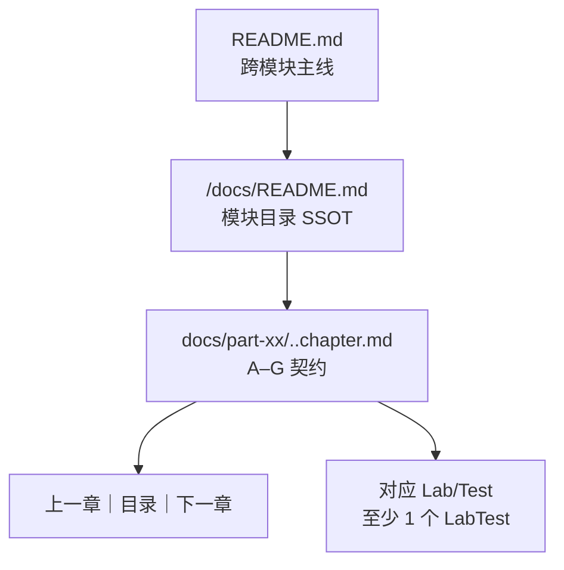

# Technical Design: 全模块文档书本化升级（A–G 章节契约 + 跨模块主线）

## Technical Solution

### Core Technologies

- Markdown（GitHub Flavored Markdown）
- Python 3（批处理 Markdown + 自检闸门脚本）
- Maven + JUnit（既有 Labs/Exercises 作为“可复现入口”约束）

### Implementation Key Points

1. **定义统一的 A–G 章节契约（SSOT：写作规范）**
   - 统一每章必须包含 7 个二级标题（`##`）：
     - `## A. 本章定位`
     - `## B. 核心结论`
     - `## C. 机制主线`
     - `## D. 源码与断点`
     - `## E. 最小可运行实验（Lab）`
     - `## F. 常见坑与边界`
     - `## G. 小结与下一章`
   - 对不同类型章节（guide/appendix/index）做“语义适配”，但结构必须存在（例如：index 章的主线是“如何使用索引”）。

2. **脚本驱动的章节重写/重排（全量 + 可重复执行）**
   - 新增批处理脚本（建议命名：`scripts/ag-contract-docs.py`）：
     - 以模块 `docs/README.md` 的章节链接清单为 SSOT
     - 对每章执行“结构化重写”：
       - 保留标题（`# ...`）与文末 BOOKIFY 导航（如需，可复用/增强 `scripts/bookify-docs.py`）
       - 将原内容按启发式规则归入 A–G（默认落入 C，并对常见段落类型做迁移：复现入口→E、坑点→F、小结→G）
       - 对 A/B/G 段落进行轻量改写：生成可复述的 bullet 结论、下一章预告
     - 幂等：重复执行不会无限叠加（建议使用稳定标记区块，或按“整章重建 + 保留白名单区块”策略实现）。

3. **强制每章至少 1 个 LabTest 的策略（先合规，再逐章精化）**
   - 现状：教学覆盖脚本允许 Exercise/Solution；本次新规则要求每章至少 1 个 `*LabTest`。
   - 推荐策略（低成本、可全量落地）：
     - 为每个模块选定 1–2 个“模块默认 LabTest”（通常是 `*LabTest` / `*MechanicsLabTest`）
     - 当章节正文无法解析出 LabTest 时，在“对应 Lab/Test”入口块补充模块默认 LabTest
     - 后续迭代再把默认入口逐章替换为“章级最小实验”

4. **模块目录页（docs/README）重排与 Part 归类优化（允许移动/重命名）**
   - 新增脚本（建议命名：`scripts/reorder-docs-readme.py`）或在批处理脚本内集成：
     - 规范化顺序：Part 00 → Part 01/02/… → Appendix（90/99）
     - 规范化编号：以文件名或显式前缀作为编号来源，必要时重命名/移动以消除歧义
     - 保持 `docs/README.md` 为章节 SSOT：章节顺序以 README 为准生成上下章导航

5. **跨模块主线（根 README）升级**
   - 根 `README.md` 增加“书本化跨模块路线（跳到模块 docs/README）”区域：
     - 业务闭环线：`springboot-*`（从基础到 business-case）
     - 机制线：`spring-core-*`（从 beans 到 aop/tx/events/resources…）
   - 入口链接统一指向：`<module>/docs/README.md`

6. **新增契约闸门（硬性验收）**
   - 新增 `scripts/check-chapter-contract.py`：
     - 以每模块 `docs/README.md` 的章节列表为检查范围（排除 README 本身）
     - 校验每章：
       - A–G 七个二级标题存在
       - “对应 Lab/Test”存在
       - 至少 1 个 `*LabTest` 引用能解析到 `src/test/java/**/**LabTest.java`
   - 更新 `scripts/check-docs.sh`：串联现有断链检查、教学覆盖检查与新契约检查。

## Architecture Design

本次变更主要是“文档信息架构（IA）+ 写作规范（Chapter Contract）”升级：

## Architecture Decision ADR

### ADR-001: 采用“脚本驱动全量重写 + 闸门强制验收”的路线
**Context:** 章节数量大（约 190），纯人工难以保证一致性与可回归。  
**Decision:** 用脚本批处理完成第一轮全量重写/重排，并新增闸门强制 A–G 与 LabTest 合规。  
**Rationale:** 保证一致性、可重复执行、可回归；对大规模文本改动风险最低。  
**Alternatives:**  
- 方案 A：纯人工逐章重写 → 拒绝原因：成本极高且一致性不可控  
- 方案 B：只加 A–G 骨架不重排内容 → 拒绝原因：不满足“1C 重写级统一”的目标  
**Impact:** 需要设计好幂等策略与“默认 LabTest”策略，避免章节合规但失去针对性。

### ADR-002: “每章至少 1 个 LabTest”先通过“模块默认入口”满足
**Context:** 部分章节天然更像索引/清单/练习题，不一定有章级 LabTest。  
**Decision:** 先用模块默认 LabTest 保证硬性合规，后续迭代再逐章收敛为章级最小实验。  
**Rationale:** 保证项目推进与验收可控，避免 190 章都被迫新增 LabTest。  
**Alternatives:**  
- 每章新增独立 LabTest → 拒绝原因：会把测试数量膨胀到不可维护  
**Impact:** 需要在文案中明确：默认入口是“兜底”，并鼓励逐章细化。

## Security and Performance

- **Security:** 仅修改仓库文档与脚本；不连接生产环境；不引入明文密钥；不执行破坏性命令（如 `rm -rf` 针对非目标目录）。
- **Performance:** 脚本扫描约 200+ Markdown 文件，预计秒级到分钟级；CI/本地回归主要成本来自 Maven 测试（可抽样）。

## Testing and Deployment

- **Docs Gate（必须全绿）：**
  - `python3 scripts/check-md-relative-links.py`
  - `python3 scripts/check-teaching-coverage.py --min-labs 2`
  - `python3 scripts/check-chapter-contract.py`
  - `bash scripts/check-docs.sh`
- **Regression（抽样）：**
  - `mvn -pl spring-core-beans test`
  - `mvn -pl springboot-web-mvc test`
  - `mvn -pl springboot-security test`
